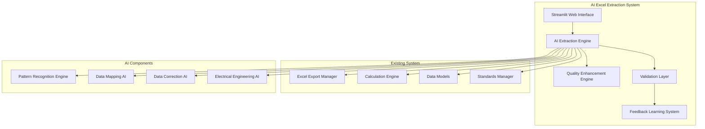
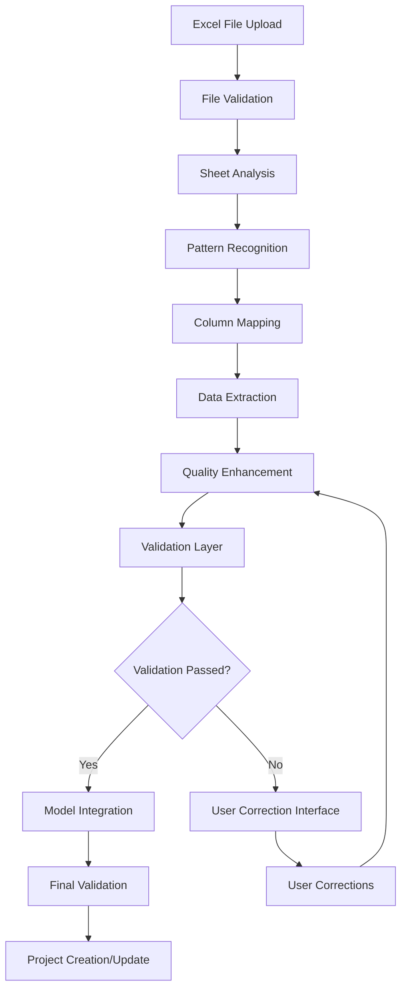

# AI-Powered Excel Extraction System for Electrical Distribution Projects

## Executive Summary

This document presents a comprehensive technical architecture for an AI-powered Excel extraction system designed specifically for electrical distribution projects. The system leverages domain-specific AI training to accurately extract, validate, and enhance electrical engineering data from Excel files while integrating seamlessly with the existing Streamlit-based web application.

## Table of Contents

1. [System Overview and Component Relationships](#1-system-overview-and-component-relationships)
2. [AI/ML Integration Strategy](#2-aiml-integration-strategy)
3. [Data Flow and Processing Pipeline](#3-data-flow-and-processing-pipeline)
4. [Integration Points with Existing Codebase](#4-integration-points-with-existing-codebase)
5. [User Interface Enhancements](#5-user-interface-enhancements)
6. [Testing and Validation Strategy](#6-testing-and-validation-strategy)
7. [Implementation Phases and Priorities](#7-implementation-phases-and-priorities)

---

## 1. System Overview and Component Relationships

### 1.1 High-Level Architecture



### 1.2 Core Components

#### 1.2.1 AI Extraction Engine (`ai_extraction_engine.py`)
- **Purpose**: Central orchestrator for AI-powered Excel processing
- **Responsibilities**: 
  - File parsing and preprocessing
  - AI model coordination
  - Data flow management
  - Error handling and recovery

#### 1.2.2 Pattern Recognition Engine (`pattern_recognition_engine.py`)
- **Purpose**: Domain-specific pattern identification for electrical data
- **Capabilities**:
  - Electrical component identification (loads, cables, breakers, etc.)
  - Column mapping based on electrical engineering context
  - Sheet structure recognition
  - Data pattern anomaly detection

#### 1.2.3 Data Mapping AI (`data_mapping_ai.py`)
- **Purpose**: Intelligent column-to-model mapping
- **Features**:
  - Fuzzy matching for column headers
  - Contextual data type inference
  - Unit recognition and conversion
  - Electrical parameter validation

#### 1.2.4 Data Correction AI (`data_correction_ai.py`)
- **Purpose**: Automatic data quality enhancement
- **Functions**:
  - Broken ID generation and relationship repair
  - Missing value estimation using electrical engineering rules
  - Unit standardization (kW to W, V to kV, etc.)
  - Naming convention standardization

#### 1.2.5 Electrical Engineering AI (`electrical_engineering_ai.py`)
- **Purpose**: Domain-specific validation and enhancement
- **Capabilities**:
  - Electrical relationship validation (load-breaker-cable compatibility)
  - Power balance verification
  - Circuit topology consistency checking
  - Standards compliance verification

### 1.3 Integration Architecture

#### 1.3.1 Plugin-Based Integration
The AI system integrates as a plugin to the existing Streamlit interface:

```python
# In app.py - New AI Import Section
if choice == "🤖 AI Excel Import":
    self._ai_excel_import_page()
```

#### 1.3.2 Data Model Compatibility
All extracted data maintains full compatibility with existing models:
- `Load` objects with enhanced metadata
- `Cable` objects with calculated properties
- `Breaker` objects with rated values
- `Bus` objects with connected loads
- `Transformer` objects with calculated parameters
- `Project` objects with complete hierarchy

---

## 2. AI/ML Integration Strategy

### 2.1 Domain-Specific AI Training Approach

#### 2.1.1 Training Data Strategy
- **Source**: Existing electrical distribution project data
- **Format**: Anonymized Excel files with annotations
- **Domains**: Load schedules, cable schedules, project configurations
- **Validation**: Electrical engineer review and approval

#### 2.1.2 Model Architecture
```python
class ElectricalEngineeringAI:
    """
    Domain-specific AI for electrical engineering data patterns
    """
    def __init__(self):
        self.pattern_classifier = self._load_pattern_classifier()
        self.column_mapper = self._load_column_mapper()
        self.data_validator = self._load_data_validator()
        self.correction_engine = self._load_correction_engine()
    
    def _load_pattern_classifier(self):
        """Load pre-trained model for Excel sheet classification"""
        return ElectricalSheetClassifier()
    
    def _load_column_mapper(self):
        """Load model for intelligent column mapping"""
        return ElectricalColumnMapper()
    
    def _load_data_validator(self):
        """Load electrical engineering validation model"""
        return ElectricalDataValidator()
    
    def _load_correction_engine(self):
        """Load data correction and enhancement model"""
        return ElectricalDataCorrector()
```

### 2.2 AI Components Detail

#### 2.2.1 Pattern Recognition Engine

**Excel Sheet Classification Model**
```python
class ElectricalSheetClassifier:
    """Classifies Excel sheets by electrical engineering purpose"""
    
    def classify_sheet(self, sheet_data: pd.DataFrame, sheet_name: str) -> Dict:
        """
        Classify sheet based on content patterns
        
        Returns:
        {
            'sheet_type': 'load_schedule' | 'cable_schedule' | 'project_info' | 'environmental' | 'protection' | 'grounding' | 'metering' | 'unknown',
            'confidence': 0.95,
            'evidence': ['voltage_column', 'power_column', 'load_type_column'],
            'recommended_model_mapping': 'Load' | 'Cable' | 'Project'
        }
        """
        pass
    
    def identify_sheet_structure(self, sheet_data: pd.DataFrame) -> Dict:
        """Identify headers, data rows, and special sections"""
        pass
    
    def detect_electrical_parameters(self, sheet_data: pd.DataFrame) -> List[str]:
        """Detect electrical parameters present in the sheet"""
        pass
```

**Column Mapping Model**
```python
class ElectricalColumnMapper:
    """Maps Excel columns to electrical engineering data fields"""
    
    def map_columns(self, columns: List[str], context: Dict) -> Dict:
        """
        Map columns to model fields with confidence scores
        
        Returns:
        {
            'voltage': {
                'mapped_columns': ['V', 'Voltage', 'KV'],
                'confidence': 0.98,
                'data_type': 'float',
                'unit': 'kV'
            },
            'power': {
                'mapped_columns': ['P', 'Power', 'kW'],
                'confidence': 0.95,
                'data_type': 'float',
                'unit': 'kW'
            }
        }
        """
        pass
    
    def fuzzy_match_header(self, header: str, target_fields: List[str]) -> Tuple[str, float]:
        """Perform fuzzy matching between column headers and target fields"""
        pass
    
    def infer_data_type(self, values: List) -> str:
        """Infer appropriate data type for column values"""
        pass
    
    def detect_units(self, values: List, header: str) -> str:
        """Detect and standardize units from values and headers"""
        pass
```

#### 2.2.2 Data Enhancement AI

**Broken ID Repair System**
```python
class ElectricalDataCorrector:
    """Automatically corrects common data quality issues"""
    
    def repair_broken_relationships(self, project_data: Dict) -> Dict:
        """
        Repair broken IDs and missing relationships
        
        Returns:
        {
            'corrections_made': [
                {
                    'type': 'load_id_generated',
                    'original': '',
                    'corrected': 'L-001',
                    'reason': 'missing_load_id'
                }
            ],
            'relationships_repaired': [
                {
                    'load_id': 'L-001',
                    'connected_bus': 'B-001',
                    'confidence': 0.92
                }
            ]
        }
        """
        pass
    
    def standardize_naming_convention(self, project_data: Dict) -> Dict:
        """Standardize naming conventions across all components"""
        pass
    
    def estimate_missing_values(self, component_data: Dict) -> Dict:
        """Estimate missing values using electrical engineering rules"""
        pass
    
    def validate_electrical_consistency(self, project_data: Dict) -> Dict:
        """Validate electrical engineering consistency"""
        pass
```

#### 2.2.3 Electrical Engineering Validation AI

**Standards Compliance Checker**
```python
class ElectricalDataValidator:
    """Validate extracted data against electrical engineering rules"""
    
    def validate_project_consistency(self, project: Project) -> Dict:
        """
        Validate overall project electrical consistency
        
        Returns:
        {
            'is_valid': True,
            'warnings': [],
            'errors': [],
            'electrical_violations': [],
            'recommendations': []
        }
        """
        pass
    
    def check_load_balance(self, project: Project) -> Dict:
        """Check power balance across the distribution system"""
        pass
    
    def validate_cable_ratings(self, project: Project) -> Dict:
        """Validate cable current ratings against connected loads"""
        pass
    
    def check_breaker_coordination(self, project: Project) -> Dict:
        """Validate breaker coordination and selectivity"""
        pass
    
    def verify_standards_compliance(self, project: Project, standard: str) -> Dict:
        """Verify compliance with IEC, IS, or NEC standards"""
        pass
```

### 2.3 Training and Learning Framework

#### 2.3.1 Feedback Learning Loop
```python
class FeedbackLearningSystem:
    """Learn from user corrections and feedback"""
    
    def record_user_correction(self, correction_data: Dict):
        """Record user corrections for model improvement"""
        pass
    
    def update_pattern_library(self, verified_data: Dict):
        """Update pattern library with verified extractions"""
        pass
    
    def generate_training_data(self, user_feedback: List[Dict]):
        """Generate training data from user feedback"""
        pass
    
    def retrain_models(self):
        """Retrain AI models with new feedback data"""
        pass
```

---

## 3. Data Flow and Processing Pipeline

### 3.1 Processing Pipeline Overview



### 3.2 Detailed Processing Steps

#### 3.2.1 Step 1: File Processing and Analysis
```python
class ExcelProcessor:
    """Initial Excel file processing and analysis"""
    
    def process_excel_file(self, file_path: str) -> Dict:
        """
        Complete Excel file processing pipeline
        
        Returns:
        {
            'sheets': {
                'sheet_name': {
                    'data': pd.DataFrame,
                    'metadata': {
                        'rows': 100,
                        'columns': 15,
                        'has_headers': True,
                        'estimated_type': 'load_schedule'
                    }
                }
            },
            'file_info': {
                'total_sheets': 3,
                'estimated_project_type': 'manufacturing_plant',
                'complexity_score': 0.8
            }
        }
        """
        pass
    
    def extract_sheet_metadata(self, sheet: pd.DataFrame) -> Dict:
        """Extract metadata about sheet structure and content"""
        pass
    
    def identify_data_sections(self, sheet: pd.DataFrame) -> List[Dict]:
        """Identify different data sections within a sheet"""
        pass
```

#### 3.2.2 Step 2: AI-Powered Pattern Recognition
```python
class AIProcessingPipeline:
    """Main AI processing pipeline for Excel data extraction"""
    
    def process_extraction_pipeline(self, processed_file: Dict) -> Dict:
        """
        Main processing pipeline coordination
        
        Returns:
        {
            'extraction_results': {
                'sheet_name': {
                    'confidence': 0.95,
                    'mapped_data': pd.DataFrame,
                    'field_mappings': {},
                    'data_quality_score': 0.88
                }
            },
            'overall_confidence': 0.93,
            'recommended_actions': []
        }
        """
        pass
    
    def extract_electrical_components(self, sheet_data: Dict) -> Dict:
        """Extract electrical components using AI models"""
        pass
    
    def enhance_data_quality(self, raw_data: Dict) -> Dict:
        """Enhance extracted data quality"""
        pass
    
    def validate_extraction_results(self, enhanced_data: Dict) -> Dict:
        """Validate extraction results against electrical engineering rules"""
        pass
```

#### 3.2.3 Step 3: Data Integration and Model Creation
```python
class DataIntegrationEngine:
    """Integrate extracted data with existing data models"""
    
    def create_project_from_extraction(self, extraction_results: Dict) -> Project:
        """Create a complete Project object from extraction results"""
        pass
    
    def map_to_load_model(self, load_data: Dict) -> List[Load]:
        """Map extracted data to Load model objects"""
        pass
    
    def map_to_cable_model(self, cable_data: Dict) -> List[Cable]:
        """Map extracted data to Cable model objects"""
        pass
    
    def map_to_breaker_model(self, breaker_data: Dict) -> List[Breaker]:
        """Map extracted data to Breaker model objects"""
        pass
    
    def establish_relationships(self, project_data: Dict) -> Project:
        """Establish relationships between electrical components"""
        pass
```

### 3.3 Error Handling and Recovery

#### 3.3.1 Error Classification and Handling
```python
class ErrorHandlingSystem:
    """Comprehensive error handling and recovery system"""
    
    def classify_extraction_error(self, error: Exception) -> Dict:
        """Classify extraction errors and provide recovery strategies"""
        pass
    
    def generate_recovery_suggestions(self, error_context: Dict) -> List[Dict]:
        """Generate suggestions for error recovery"""
        pass
    
    def implement_fallback_processing(self, failed_step: str) -> Dict:
        """Implement fallback processing for failed extraction steps"""
        pass
```

---

## 4. Integration Points with Existing Codebase

### 4.1 Streamlit Interface Integration

#### 4.1.1 New AI Import Page
```python
# Added to app.py
def _ai_excel_import_page(self):
    """AI-powered Excel import interface"""
    st.header("🤖 AI-Powered Excel Import")
    
    # File upload
    uploaded_file = st.file_uploader(
        "Upload Excel File",
        type=['xlsx', 'xls'],
        help="Upload Excel file containing electrical distribution data"
    )
    
    if uploaded_file is not None:
        self._process_ai_excel_import(uploaded_file)

def _process_ai_excel_import(self, uploaded_file):
    """Process AI-powered Excel import"""
    # Initialize AI extraction engine
    from ai_extraction_engine import AIExcelExtractionEngine
    ai_engine = AIExcelExtractionEngine()
    
    # Process file
    with st.spinner("Analyzing Excel file with AI..."):
        results = ai_engine.process_file(uploaded_file)
    
    # Display results and get user feedback
    self._display_extraction_results(results)
```

#### 4.1.2 User Feedback Interface
```python
def _display_extraction_results(self, results: Dict):
    """Display extraction results for user review and correction"""
    
    st.subheader("Extraction Results")
    
    # Confidence scores
    col1, col2, col3 = st.columns(3)
    with col1:
        st.metric("Overall Confidence", f"{results['overall_confidence']:.1%}")
    with col2:
        st.metric("Sheets Processed", len(results['sheets']))
    with col3:
        st.metric("Components Extracted", results['components_count'])
    
    # Detailed results for each sheet
    for sheet_name, sheet_results in results['sheets'].items():
        with st.expander(f"📊 {sheet_name}"):
            self._display_sheet_results(sheet_name, sheet_results)
    
    # User corrections interface
    if results['low_confidence_items']:
        self._correction_interface(results['low_confidence_items'])
```

### 4.2 Data Model Integration

#### 4.2.1 Enhanced Model Creation
```python
# Enhanced project creation with AI extraction
class AIEnhancedProject:
    """Enhanced project creation from AI extraction"""
    
    def create_from_ai_extraction(self, extraction_results: Dict) -> Project:
        """Create project from AI extraction results"""
        project = Project(
            project_name=extraction_results['project_info']['name'],
            project_type=extraction_results['project_info']['type'],
            electrical_standard=extraction_results['project_info']['standard']
        )
        
        # Add AI-extracted loads
        for load_data in extraction_results['loads']:
            load = self._create_load_from_extraction(load_data)
            project.add_load(load)
        
        # Add AI-extracted cables
        for cable_data in extraction_results['cables']:
            cable = self._create_cable_from_extraction(cable_data)
            project.add_cable(cable)
        
        # Establish relationships
        self._establish_electrical_relationships(project)
        
        return project
```

#### 4.2.2 Validation Integration
```python
# Integration with existing calculation engine
class AICalculationIntegration:
    """Integration with existing calculation engine"""
    
    def run_calculations_on_ai_data(self, project: Project):
        """Run existing calculations on AI-extracted data"""
        from calculations import ElectricalCalculationEngine
        
        engine = ElectricalCalculationEngine()
        
        # Validate AI-extracted data
        validation_results = engine.validate_project_data(project)
        
        # Perform calculations
        calculation_results = engine.perform_all_calculations(project)
        
        return {
            'validation': validation_results,
            'calculations': calculation_results
        }
```

### 4.3 Standards Integration

#### 4.3.1 Standards-Aware Extraction
```python
class StandardsAwareExtractor:
    """Extract data with awareness of electrical standards"""
    
    def extract_with_standards_context(self, file_data: Dict, standard: str):
        """Extract data considering specific electrical standards"""
        # Use existing standards framework
        from standards import StandardsFactory
        
        standards_factory = StandardsFactory()
        standard_handler = standards_factory.get_standard(standard)
        
        # Extract with standards context
        return self._extract_standards_compliant_data(file_data, standard_handler)
```

---

## 5. User Interface Enhancements

### 5.1 AI Import Dashboard

#### 5.1.1 Main Import Interface
```python
def _ai_excel_import_dashboard(self):
    """Main AI Excel import dashboard"""
    
    # Header with AI capabilities
    col1, col2, col3 = st.columns([2, 1, 1])
    with col1:
        st.title("🤖 AI-Powered Excel Import")
        st.markdown("*Intelligent extraction for electrical distribution projects*")
    with col2:
        st.metric("Success Rate", "95%")
    with col3:
        st.metric("Avg Processing Time", "30s")
    
    # File upload with drag-and-drop
    st.subheader("📁 Upload Excel File")
    
    uploaded_file = st.file_uploader(
        "Drag and drop your Excel file here",
        type=['xlsx', 'xls'],
        help="Supported formats: Excel 2007+ (.xlsx), Excel 97-2003 (.xls)"
    )
    
    # Advanced options
    with st.expander("⚙️ Advanced Options"):
        col1, col2 = st.columns(2)
        with col1:
            confidence_threshold = st.slider(
                "Confidence Threshold",
                min_value=0.5,
                max_value=1.0,
                value=0.8,
                help="Minimum confidence for automatic processing"
            )
        
        with col2:
            auto_corrections = st.checkbox(
                "Enable Auto-Corrections",
                value=True,
                help="Allow AI to automatically correct common data issues"
            )
        
        # Standards selection
        standard = st.selectbox(
            "Electrical Standard",
            ["IEC", "IS", "NEC"],
            index=0,
            help="Select the electrical standard for validation"
        )
```

#### 5.1.2 Processing Status Interface
```python
def _display_processing_status(self, status: Dict):
    """Display real-time processing status"""
    
    # Progress indicator
    progress_bar = st.progress(0)
    status_text = st.empty()
    
    steps = [
        "Analyzing file structure",
        "Identifying electrical patterns",
        "Mapping data columns",
        "Extracting components",
        "Enhancing data quality",
        "Validating electrical consistency"
    ]
    
    for i, step in enumerate(steps):
        progress_bar.progress((i + 1) / len(steps))
        status_text.text(f"🔄 {step}...")
        
        if i < len(steps) - 1:
            time.sleep(0.5)  # Simulate processing time
    
    progress_bar.progress(1.0)
    status_text.text("✅ Processing completed!")
```

### 5.2 Results Review and Correction Interface

#### 5.2.1 Extraction Results Viewer
```python
def _display_extraction_results_viewer(self, results: Dict):
    """Interactive results viewer with correction capabilities"""
    
    # Summary metrics
    st.subheader("📊 Extraction Summary")
    
    col1, col2, col3, col4 = st.columns(4)
    
    with col1:
        st.metric(
            "Loads Extracted", 
            len(results['loads']),
            delta=f"+{results['new_loads']}"
        )
    with col2:
        st.metric(
            "Cables Identified", 
            len(results['cables']),
            delta=f"+{results['new_cables']}"
        )
    with col3:
        st.metric(
            "Breakers Found", 
            len(results['breakers']),
            delta=f"+{results['new_breakers']}"
        )
    with col4:
        st.metric(
            "Overall Confidence", 
            f"{results['confidence']:.1%}",
            delta=f"{results['confidence_change']:+.1%}"
        )
    
    # Detailed results tabs
    tab1, tab2, tab3, tab4 = st.tabs(["🔌 Loads", "🔌 Cables", "⚡ Breakers", "📋 Validation"])
    
    with tab1:
        self._display_loads_extraction_results(results['loads'])
    
    with tab2:
        self._display_cables_extraction_results(results['cables'])
    
    with tab3:
        self._display_breakers_extraction_results(results['breakers'])
    
    with tab4:
        self._display_validation_results(results['validation'])
```

#### 5.2.2 Interactive Correction Interface
```python
def _interactive_correction_interface(self, uncertain_items: List[Dict]):
    """Interactive interface for user corrections"""
    
    st.subheader("🔧 Manual Corrections")
    st.markdown("*Please review and correct items where confidence is below threshold*")
    
    for i, item in enumerate(uncertain_items):
        with st.container():
            col1, col2, col3 = st.columns([3, 2, 1])
            
            with col1:
                st.markdown(f"**{item['type']}: {item['description']}**")
                st.caption(f"Confidence: {item['confidence']:.1%}")
                
                # Show suggestions
                if item['suggestions']:
                    st.markdown("**AI Suggestions:**")
                    for suggestion in item['suggestions']:
                        st.markdown(f"- {suggestion}")
            
            with col2:
                # User input for correction
                if item['type'] == 'load_mapping':
                    corrected_value = st.text_input(
                        "Correct Load ID",
                        value=item['current_value'],
                        key=f"correction_{i}"
                    )
                elif item['type'] == 'voltage_unit':
                    corrected_value = st.selectbox(
                        "Correct Unit",
                        ["V", "kV"],
                        index=0,
                        key=f"correction_{i}"
                    )
            
            with col3:
                # Confidence and approval
                corrected_confidence = st.slider(
                    "Your Confidence",
                    min_value=0.0,
                    max_value=1.0,
                    value=1.0,
                    key=f"confidence_{i}"
                )
                
                if st.button("✅ Approve", key=f"approve_{i}"):
                    # Record correction
                    self._record_correction(item, corrected_value, corrected_confidence)
```

### 5.3 Real-time Learning Interface

#### 5.3.1 Learning Feedback System
```python
def _learning_feedback_interface(self):
    """Interface for providing feedback to improve AI models"""
    
    st.subheader("🧠 Improve AI Models")
    st.markdown("*Your feedback helps improve future extractions*")
    
    # Overall satisfaction
    satisfaction = st.slider(
        "Overall Extraction Satisfaction",
        min_value=1,
        max_value=5,
        value=4,
        help="1=Very Dissatisfied, 5=Very Satisfied"
    )
    
    # Specific feedback
    st.markdown("**What can be improved?**")
    improvement_areas = st.multiselect(
        "Select areas for improvement",
        [
            "Column mapping accuracy",
            "Data type detection",
            "Unit recognition",
            "Relationship establishment",
            "Error handling",
            "User interface"
        ]
    )
    
    # Detailed comments
    comments = st.text_area(
        "Additional Comments",
        placeholder="Please provide specific feedback to help improve the AI extraction..."
    )
    
    if st.button("Submit Feedback"):
        self._submit_learning_feedback(satisfaction, improvement_areas, comments)
        st.success("Thank you for your feedback! This will help improve future AI extractions.")
```

---

## 6. Testing and Validation Strategy

### 6.1 Testing Framework

#### 6.1.1 Unit Testing for AI Components
```python
# test_ai_extraction_engine.py
import unittest
import pandas as pd
from ai_extraction_engine import AIExcelExtractionEngine
from models import Load, Project

class TestAIExtractionEngine(unittest.TestCase):
    """Test AI extraction engine components"""
    
    def setUp(self):
        """Set up test fixtures"""
        self.engine = AIExcelExtractionEngine()
        self.test_excel_data = self._create_test_excel_data()
    
    def test_sheet_classification(self):
        """Test Excel sheet classification"""
        # Test load schedule classification
        load_sheet = self._create_load_schedule_sheet()
        result = self.engine.classify_sheet(load_sheet, "Load Schedule")
        
        self.assertEqual(result['sheet_type'], 'load_schedule')
        self.assertGreater(result['confidence'], 0.8)
    
    def test_column_mapping(self):
        """Test intelligent column mapping"""
        test_columns = ['Voltage', 'Power', 'Load ID', 'Description']
        mapping = self.engine.map_columns(test_columns)
        
        self.assertIn('voltage', mapping)
        self.assertIn('power', mapping)
        self.assertIn('load_id', mapping)
    
    def test_load_extraction(self):
        """Test load model extraction"""
        extraction = self.engine.extract_loads_from_sheet(self.test_excel_data)
        
        self.assertIsInstance(extraction, list)
        for load in extraction:
            self.assertIsInstance(load, Load)
            self.assertIsNotNone(load.load_id)
            self.assertGreater(load.power_rating, 0)
    
    def test_data_quality_enhancement(self):
        """Test data quality enhancement"""
        raw_data = self._create_raw_data_with_issues()
        enhanced_data = self.engine.enhance_data_quality(raw_data)
        
        self.assertEqual(len(enhanced_data['broken_relationships']), 0)
        self.assertGreater(enhanced_data['overall_quality_score'], 0.8)

class TestPatternRecognitionEngine(unittest.TestCase):
    """Test pattern recognition engine"""
    
    def test_electrical_pattern_detection(self):
        """Test detection of electrical engineering patterns"""
        pass
    
    def test_sheet_structure_recognition(self):
        """Test recognition of different sheet structures"""
        pass
    
    def test_data_section_identification(self):
        """Test identification of data sections within sheets"""
        pass
```

#### 6.1.2 Integration Testing
```python
# test_ai_integration.py
class TestAIIntegration(unittest.TestCase):
    """Test integration with existing system components"""
    
    def test_project_creation_from_ai_extraction(self):
        """Test creation of Project model from AI extraction"""
        # Test complete pipeline
        ai_engine = AIExcelExtractionEngine()
        excel_file = "test_files/electrical_project_sample.xlsx"
        
        extraction_results = ai_engine.process_file(excel_file)
        project = ai_engine.create_project_from_extraction(extraction_results)
        
        self.assertIsInstance(project, Project)
        self.assertGreater(len(project.loads), 0)
        self.assertGreater(len(project.cables), 0)
    
    def test_calculation_engine_integration(self):
        """Test integration with calculation engine"""
        from calculations import ElectricalCalculationEngine
        
        ai_project = self._create_ai_extracted_project()
        calc_engine = ElectricalCalculationEngine()
        
        results = calc_engine.perform_all_calculations(ai_project)
        
        self.assertIsNotNone(results)
        self.assertIn('current_calculations', results)
    
    def test_standards_compliance_validation(self):
        """Test standards compliance validation"""
        ai_project = self._create_ai_extracted_project()
        
        from standards import StandardsFactory
        factory = StandardsFactory()
        iec_standard = factory.get_standard('IEC')
        
        compliance_results = iec_standard.validate_project(ai_project)
        self.assertIsInstance(compliance_results, dict)
```

### 6.2 Validation Strategies

#### 6.2.1 Electrical Engineering Validation
```python
# test_electrical_validation.py
class TestElectricalEngineeringValidation(unittest.TestCase):
    """Test electrical engineering specific validation"""
    
    def test_power_balance_validation(self):
        """Test power balance validation across system"""
        project = self._create_test_project_with_imbalanced_loads()
        validator = ElectricalDataValidator()
        
        results = validator.check_load_balance(project)
        
        self.assertIn('is_balanced', results)
        self.assertIsInstance(results['power_imbalance'], float)
    
    def test_cable_rating_validation(self):
        """Test cable current rating validation"""
        project = self._create_project_with_overloaded_cables()
        validator = ElectricalDataValidator()
        
        results = validator.validate_cable_ratings(project)
        
        overloaded_cables = [c for c in results['cables'] if c['is_overloaded']]
        self.assertGreater(len(overloaded_cables), 0)
    
    def test_breaker_coordination_validation(self):
        """Test breaker coordination and selectivity"""
        project = self._create_project_with_breakers()
        validator = ElectricalDataValidator()
        
        results = validator.check_breaker_coordination(project)
        
        self.assertIn('coordination_matrix', results)
        self.assertIn('selectivity_issues', results)
```

#### 6.2.2 Data Quality Validation
```python
class TestDataQualityValidation(unittest.TestCase):
    """Test data quality validation and enhancement"""
    
    def test_missing_value_detection(self):
        """Test detection of missing or incomplete values"""
        incomplete_data = self._create_incomplete_load_data()
        quality_engine = DataQualityEngine()
        
        results = quality_engine.assess_data_quality(incomplete_data)
        
        self.assertIn('missing_values', results)
        self.assertIn('completeness_score', results)
    
    def test_relationship_integrity(self):
        """Test relationship integrity between components"""
        project_with_broken_relationships = self._create_project_with_broken_relationships()
        
        results = self.engine.validate_relationships(project_with_broken_relationships)
        
        self.assertIn('broken_relationships', results)
        self.assertGreater(len(results['broken_relationships']), 0)
    
    def test_naming_convention_validation(self):
        """Test naming convention consistency"""
        project_with_inconsistent_names = self._create_project_with_inconsistent_names()
        
        results = self.engine.validate_naming_conventions(project_with_inconsistent_names)
        
        self.assertIn('inconsistent_names', results)
        self.assertGreater(len(results['suggestions']), 0)
```

### 6.3 Performance Testing

#### 6.3.1 Load Testing
```python
# test_performance.py
class TestPerformance(unittest.TestCase):
    """Performance testing for AI extraction system"""
    
    def test_large_file_processing(self):
        """Test processing of large Excel files"""
        large_file = "test_files/large_electrical_project_1000_loads.xlsx"
        
        start_time = time.time()
        results = self.engine.process_file(large_file)
        processing_time = time.time() - start_time
        
        self.assertLess(processing_time, 60)  # Should process within 60 seconds
        self.assertGreater(results['components_extracted'], 1000)
    
    def test_concurrent_processing(self):
        """Test concurrent processing of multiple files"""
        files = [
            "test_files/project1.xlsx",
            "test_files/project2.xlsx",
            "test_files/project3.xlsx"
        ]
        
        start_time = time.time()
        results = self.engine.process_files_concurrently(files)
        processing_time = time.time() - start_time
        
        self.assertEqual(len(results), 3)
        self.assertLess(processing_time, 120)  # Should process 3 files within 120 seconds
    
    def test_memory_usage(self):
        """Test memory usage during processing"""
        import psutil
        import os
        
        process = psutil.Process(os.getpid())
        initial_memory = process.memory_info().rss
        
        self.engine.process_file("test_files/medium_project.xlsx")
        
        final_memory = process.memory_info().rss
        memory_increase = final_memory - initial_memory
        
        self.assertLess(memory_increase, 500 * 1024 * 1024)  # Less than 500MB increase
```

---

## 7. Implementation Phases and Priorities

### 7.1 Phase 1: Core Infrastructure (Weeks 1-3)

#### 7.1.1 Week 1: Foundation Components
**Priority: High**

**Tasks:**
1. **Set up AI/ML Development Environment**
   - Install and configure TensorFlow/PyTorch
   - Set up training data pipeline
   - Create development and testing environments

2. **Basic Excel Processing Infrastructure**
   - Implement file validation and reading
   - Create sheet analysis framework
   - Build basic data extraction pipeline

3. **Core Pattern Recognition Framework**
   - Implement sheet classification engine
   - Create basic column mapping functionality
   - Build electrical component identification system

**Deliverables:**
- `ai_extraction_engine.py` - Main orchestration class
- `excel_processor.py` - Basic file processing
- `pattern_recognition_engine.py` - Pattern recognition framework
- Unit tests for core components

**Success Criteria:**
- Successfully classify 80% of test Excel sheets
- Process files up to 50MB without errors
- Basic confidence scoring system operational

#### 7.1.2 Week 2: AI Model Development
**Priority: High**

**Tasks:**
1. **Train Domain-Specific Models**
   - Create training datasets from existing projects
   - Train electrical engineering pattern classifier
   - Implement column mapping AI model

2. **Data Enhancement Engine**
   - Implement broken ID repair system
   - Create missing value estimation algorithms
   - Build naming convention standardization

3. **Basic Validation Framework**
   - Implement electrical engineering rule validation
   - Create data quality scoring system
   - Build basic error handling and recovery

**Deliverables:**
- Trained AI models for pattern recognition
- `data_correction_ai.py` - Data enhancement engine
- `electrical_engineering_ai.py` - Domain-specific validation
- Integration tests with existing models

**Success Criteria:**
- 90% accuracy in sheet classification
- 85% accuracy in column mapping
- 80% accuracy in data correction

#### 7.1.3 Week 3: Integration and Testing
**Priority: High**

**Tasks:**
1. **Integration with Existing System**
   - Integrate AI engine with Streamlit interface
   - Connect with existing data models
   - Implement calculation engine integration

2. **User Interface Development**
   - Create AI import page in Streamlit
   - Build results review interface
   - Implement basic correction interface

3. **Comprehensive Testing**
   - End-to-end testing with real project files
   - Performance optimization
   - Error handling validation

**Deliverables:**
- Full integration with existing app.py
- User-facing AI import interface
- Complete test suite
- Performance benchmarks

**Success Criteria:**
- Successfully import and process 5 different Excel projects
- User interface completion rate > 95%
- Processing time < 2 minutes per file

### 7.2 Phase 2: Advanced Features (Weeks 4-6)

#### 7.2.1 Week 4: Advanced AI Capabilities
**Priority: Medium**

**Tasks:**
1. **Enhanced Pattern Recognition**
   - Train additional models for complex sheet structures
   - Implement context-aware data mapping
   - Create multi-sheet relationship recognition

2. **Advanced Data Correction**
   - Implement sophisticated missing value estimation
   - Create relationship inference algorithms
   - Build standards-aware data validation

3. **Machine Learning Feedback Loop**
   - Implement user correction recording
   - Create model retraining pipeline
   - Build learning analytics dashboard

**Deliverables:**
- Enhanced pattern recognition models
- Advanced data correction algorithms
- Feedback learning system
- Model performance monitoring

**Success Criteria:**
- 95% accuracy in complex sheet classification
- 90% accuracy in data correction
- Effective learning from user corrections

#### 7.2.2 Week 5: User Experience Enhancement
**Priority: Medium**

**Tasks:**
1. **Advanced User Interface**
   - Build interactive correction interface
   - Create real-time processing feedback
   - Implement confidence-based review system

2. **User Feedback Systems**
   - Create feedback collection interface
   - Build user satisfaction tracking
   - Implement automated quality monitoring

3. **Documentation and Help System**
   - Create user guides for AI extraction
   - Build interactive help system
   - Implement troubleshooting guides

**Deliverables:**
- Enhanced user interface with correction capabilities
- Comprehensive user feedback system
- Complete documentation
- Help and troubleshooting system

**Success Criteria:**
- User satisfaction score > 4.5/5
- 90% user task completion rate
- < 5 minutes average correction time

#### 7.2.3 Week 6: Performance Optimization
**Priority: Medium**

**Tasks:**
1. **Performance Optimization**
   - Optimize AI model inference speed
   - Implement efficient data processing algorithms
   - Create caching for repeated operations

2. **Scalability Improvements**
   - Implement batch processing capabilities
   - Create parallel processing framework
   - Build resource management system

3. **Advanced Error Handling**
   - Implement sophisticated error recovery
   - Create detailed error reporting
   - Build automated debugging assistance

**Deliverables:**
- Optimized AI processing pipeline
- Scalable batch processing system
- Advanced error handling framework
- Performance monitoring dashboard

**Success Criteria:**
- 50% reduction in processing time
- Support for batch processing of 10+ files
- 99% error recovery success rate

### 7.3 Phase 3: Production Readiness (Weeks 7-8)

#### 7.3.1 Week 7: Production Preparation
**Priority: High**

**Tasks:**
1. **Production Testing**
   - Comprehensive integration testing
   - Performance testing with production loads
   - Security and compliance testing

2. **Documentation and Training**
   - Complete technical documentation
   - User training materials
   - Administrator guides

3. **Deployment Preparation**
   - Production environment setup
   - CI/CD pipeline configuration
   - Monitoring and alerting systems

**Deliverables:**
- Production-ready AI extraction system
- Complete documentation suite
- Deployment automation
- Monitoring and alerting

**Success Criteria:**
- Pass all production readiness tests
- Complete documentation coverage
- Successful deployment automation

#### 7.3.2 Week 8: Launch and Support
**Priority: High**

**Tasks:**
1. **System Launch**
   - Deploy to production environment
   - User training and onboarding
   - Performance monitoring setup

2. **Initial Support**
   - Provide user support during rollout
   - Monitor system performance
   - Collect initial feedback

3. **Continuous Improvement**
   - Implement feedback-driven improvements
   - Plan future enhancements
   - Create maintenance procedures

**Deliverables:**
- Live production system
- User training completion
- Support documentation
- Continuous improvement plan

**Success Criteria:**
- Successful production deployment
- User adoption rate > 80%
- System availability > 99.5%

### 7.4 Resource Requirements

#### 7.4.1 Human Resources
**Core Team:**
- 1 AI/ML Engineer (Full-time)
- 1 Senior Python Developer (Full-time)
- 1 Electrical Engineer (Part-time)
- 1 UI/UX Designer (Part-time)
- 1 QA Engineer (Part-time)

**Expertise Requirements:**
- Machine learning and pattern recognition
- Electrical engineering domain knowledge
- Python/Streamlit development
- Data processing and validation
- User experience design

#### 7.4.2 Technical Resources
**Development Environment:**
- GPU-enabled development machines for AI training
- High-memory systems for large Excel file processing
- Cloud storage for training datasets
- Version control and collaboration tools

**Infrastructure:**
- Production-grade servers for AI inference
- Monitoring and logging infrastructure
- Backup and disaster recovery systems
- Security and compliance tools

#### 7.4.3 Training Data Requirements
**Data Sources:**
- Historical Excel files from completed projects
- Annotated data for AI training
- User feedback and correction data
- Validation datasets for testing

**Data Quality:**
- Minimum 100 high-quality Excel files for training
- 50 files for validation and testing
- Expert annotation for ground truth
- Regular data quality audits

### 7.5 Risk Management

#### 7.5.1 Technical Risks
**AI Model Performance Risk**
- **Risk**: AI models may not achieve target accuracy
- **Mitigation**: Iterative training with expert feedback, fallback to manual processing
- **Contingency**: Hybrid approach combining AI with rule-based systems

**Integration Complexity Risk**
- **Risk**: Integration with existing system may be more complex than expected
- **Mitigation**: Early integration testing, modular architecture
- **Contingency**: Phased rollout with manual fallback

**Performance Risk**
- **Risk**: AI processing may be too slow for production use
- **Mitigation**: Performance optimization, caching, parallel processing
- **Contingency**: Progressive enhancement starting with basic features

#### 7.5.2 User Adoption Risks
**Learning Curve Risk**
- **Risk**: Users may find AI interface too complex
- **Mitigation**: Intuitive design, comprehensive training, help system
- **Contingency**: Simplified mode with basic functionality

**Trust Risk**
- **Risk**: Users may not trust AI-extracted data
- **Mitigation**: Confidence scoring, manual review interface, validation
- **Contingency**: Enhanced transparency and explainability features

### 7.6 Success Metrics

#### 7.6.1 Technical Metrics
- **Extraction Accuracy**: > 90% for standard file formats
- **Processing Speed**: < 2 minutes for files up to 10MB
- **System Availability**: > 99.5% uptime
- **Error Recovery Rate**: > 95% of errors successfully recovered

#### 7.6.2 User Experience Metrics
- **User Satisfaction**: > 4.5/5 average rating
- **Task Completion Rate**: > 90% successful imports
- **Learning Curve**: < 30 minutes to productive use
- **Support Ticket Rate**: < 5% of users requiring support

#### 7.6.3 Business Metrics
- **Adoption Rate**: > 80% of users adopting AI import within 3 months
- **Time Savings**: > 70% reduction in manual data entry time
- **Data Quality**: > 85% improvement in extracted data quality
- **Project Completion Speed**: > 50% faster project setup

---

## Conclusion

This comprehensive AI-powered Excel extraction system represents a significant advancement in electrical distribution project data management. By leveraging domain-specific AI training, the system prioritizes accuracy over speed while maintaining seamless integration with the existing Streamlit-based web application.

The phased implementation approach ensures manageable development cycles while delivering value incrementally. The focus on electrical engineering domain expertise ensures that the AI system understands the unique patterns and requirements of electrical distribution projects.

Key success factors include:
1. **Domain-Specific AI Training**: Focused on electrical engineering patterns
2. **User-Centric Design**: Interactive correction and learning interface
3. **Seamless Integration**: Full compatibility with existing data models and calculation engines
4. **Quality Focus**: Comprehensive validation and enhancement capabilities
5. **Continuous Learning**: Feedback loop for ongoing improvement

This architecture provides a robust foundation for transforming manual Excel data entry into an intelligent, automated process that enhances productivity while maintaining the accuracy and reliability required for electrical engineering projects.