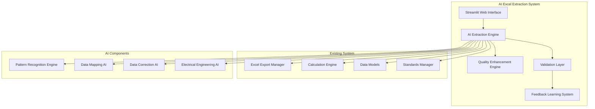
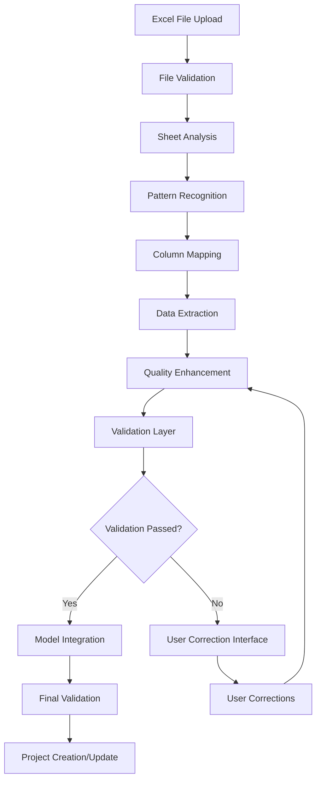

# Architecture Overview - AI Excel Extraction System

## System Architecture

The AI Excel Extraction System is built on a modular, scalable architecture designed for electrical engineering domain expertise and intelligent data processing.

## 🏗️ High-Level Architecture

### Core Components



### Component Relationships

#### 1. **Main Orchestrator (AIExcelExtractor)**
- **Responsibility**: Coordinates the entire extraction pipeline
- **Dependencies**: All specialized AI components
- **Output**: Complete ProcessingReport with project data

#### 2. **Pattern Recognition Engine (SheetClassifier)**
- **Responsibility**: Identifies electrical data patterns in Excel sheets
- **Domain Knowledge**: Electrical engineering terminology and structures
- **Output**: Sheet type classification with confidence scores

#### 3. **Data Mapping AI (ColumnMapper)**
- **Responsibility**: Maps Excel columns to electrical engineering fields
- **Technology**: Fuzzy string matching with electrical context
- **Output**: Intelligent column-to-field mappings

#### 4. **Data Correction AI (DataEnhancer)**
- **Responsibility**: Auto-corrects common data quality issues
- **Features**: ID generation, relationship repair, standardization
- **Output**: Enhanced data with correction report

#### 5. **Electrical Engineering AI (ValidationEngine)**
- **Responsibility**: Validates data against electrical engineering rules
- **Standards**: IEC, IS, NEC compliance checking
- **Output**: Validation results with quality scoring

## 📊 Data Flow Architecture

### Processing Pipeline



### Data Transformation Stages

#### Stage 1: File Ingestion
```python
# Excel file reading and validation
excel_data = pd.read_excel(file_path, sheet_name=None)
file_metadata = {
    'total_sheets': len(excel_data),
    'file_size': os.path.getsize(file_path),
    'estimated_complexity': assess_complexity(excel_data)
}
```

#### Stage 2: Pattern Recognition
```python
# Sheet classification with electrical context
classification_results = {
    'load_schedule': {
        'confidence': 0.95,
        'evidence': ['power (kw)', 'voltage (v)', 'load id'],
        'recommended_model': 'Load'
    },
    'cable_schedule': {
        'confidence': 0.88,
        'evidence': ['size (mm²)', 'from equipment', 'to equipment'],
        'recommended_model': 'Cable'
    }
}
```

#### Stage 3: Column Mapping
```python
# Intelligent column-to-field mapping
field_mappings = {
    'load_id': {
        'mapped_columns': ['Load ID', 'Equipment ID'],
        'confidence': 0.96,
        'data_type': 'str'
    },
    'power_kw': {
        'mapped_columns': ['Power (kW)', 'Rating kW'],
        'confidence': 0.94,
        'data_type': 'float'
    }
}
```

#### Stage 4: Data Extraction
```python
# Component extraction with validation
extracted_loads = [
    Load(
        load_id='L001',
        load_name='Main Pump Motor',
        power_kw=5.5,
        voltage=400,
        # ... other validated parameters
    )
]
```

#### Stage 5: Quality Enhancement
```python
# Automatic corrections and improvements
corrections = [
    {
        'type': 'load_id_fixed',
        'original': None,
        'corrected': 'L001',
        'reason': 'missing_load_id'
    },
    {
        'type': 'load_bus_assignment',
        'load_id': 'L001',
        'bus_id': 'B001',
        'reason': 'missing_bus_assignment'
    }
]
```

## 🧠 AI Component Architecture

### Pattern Recognition Engine

#### Architecture Design
```
SheetClassifier
├── Pattern Libraries
│   ├── load_patterns (primary/secondary)
│   ├── cable_patterns (primary/secondary)
│   ├── bus_patterns (primary/secondary)
│   └── transformer_patterns (primary/secondary)
├── Scoring Algorithm
│   ├── Pattern Matching (regex)
│   ├── Weight Calculation
│   └── Confidence Normalization
└── Classification Logic
    ├── Best Match Selection
    ├── Evidence Tracking
    └── Model Mapping
```

#### Pattern Recognition Strategy
- **Primary Patterns**: Critical electrical parameters (load ID, power, voltage)
- **Secondary Patterns**: Supporting parameters (power factor, efficiency)
- **Weighted Scoring**: Primary patterns have higher weight
- **Confidence Normalization**: Scores normalized to 0.0-1.0 range

### Data Mapping AI

#### Fuzzy Matching Architecture
```
ColumnMapper
├── Field Pattern Libraries
│   ├── Load fields (15+ patterns each)
│   ├── Cable fields (10+ patterns each)
│   └── Bus fields (8+ patterns each)
├── Fuzzy Matching Engine
│   ├── Direct String Similarity
│   ├── Pattern-based Matching
│   └── Contextual Enhancement
├── Data Type Inference
│   ├── Numeric Patterns (power, voltage, current)
│   ├── Text Patterns (IDs, names, types)
│   └── Boolean Patterns (armored, shielded)
└── Quality Assessment
    ├── Mapping Coverage Analysis
    ├── Confidence Aggregation
    └── Quality Scoring
```

#### Matching Algorithms
1. **Direct Similarity**: String matching between column and field names
2. **Pattern Matching**: Regex patterns for electrical terminology
3. **Contextual Enhancement**: Sheet context influences matching
4. **Multi-pass Mapping**: Primary mapping followed by gap-filling

### Data Correction AI

#### Enhancement Architecture
```
DataEnhancer
├── ID Generation System
│   ├── Load ID patterns (L001, L002, ...)
│   ├── Cable ID patterns (C001, C002, ...)
│   └── Bus ID patterns (B001, B002, ...)
├── Relationship Management
│   ├── Load-to-Bus Assignment
│   ├── Cable Connection Repair
│   └── System Topology Building
├── Standardization Engine
│   ├── Naming Convention Standardization
│   ├── Unit Standardization
│   └── Value Range Validation
└── Calculation Integration
    ├── Electrical Parameter Calculation
    ├── Power Balance Verification
    └── Design Current Computation
```

#### Correction Strategies
1. **Systematic ID Generation**: Sequential numbering with prefix
2. **Intelligent Defaults**: Context-aware default value assignment
3. **Relationship Inference**: Smart connection establishment
4. **Electrical Rule Application**: Domain-specific validation

### Validation Engine

#### Electrical Engineering Validation
```
ValidationEngine
├── Standards Compliance
│   ├── IEC 60364 Rules
│   ├── IS Standards Rules
│   └── NEC Standards Rules
├── Electrical Safety Checks
│   ├── Cable Current Rating Verification
│   ├── Voltage Drop Analysis
│   └── Short Circuit Rating Validation
├── System Consistency
│   ├── Power Balance Verification
│   ├── Load Distribution Analysis
│   └── Breaker Coordination Check
└── Quality Assessment
    ├── Component-level Validation
    ├── System-level Validation
    └── Overall Quality Scoring
```

## 🔄 Integration Architecture

### Existing System Integration

#### Model Integration
```python
# Seamless integration with existing models
from models import Load, Cable, Bus, Project, LoadType

# AI extraction creates standard model objects
extracted_load = Load(
    load_id='L001',
    load_name='Main Pump Motor',
    power_kw=5.5,
    voltage=400,
    load_type=LoadType.MOTOR,
    # ... all standard parameters
)

# Integration with calculation engine
from calculations import ElectricalCalculationEngine
calc_engine = ElectricalCalculationEngine()
calc_engine.calculate_load(extracted_load)
```

#### Standards Integration
```python
# Integration with existing standards framework
from standards import StandardsFactory

standards_factory = StandardsFactory()
iec_standard = standards_factory.get_standard('IEC')

# AI extraction validates against standards
validation_results = iec_standard.validate_project(ai_project)
```

#### Streamlit Interface Integration
```python
# Plugin-based integration with Streamlit UI
def _ai_excel_import_page(self):
    """AI-powered Excel import interface"""
    
    # Initialize AI engine
    from ai_excel_extractor import AIExcelExtractor
    ai_engine = AIExcelExtractor()
    
    # Process file with AI
    if uploaded_file:
        report = ai_engine.process_excel_file(uploaded_file)
        self._display_extraction_results(report)
```

## 📈 Scalability Architecture

### Performance Optimization

#### Memory Management
```python
# Efficient memory usage for large files
class AIExcelExtractor:
    def process_excel_file(self, file_path: str) -> ProcessingReport:
        # Stream processing for large files
        with pd.ExcelFile(file_path) as xls:
            for sheet_name in xls.sheet_names:
                # Process sheet by sheet to manage memory
                df = pd.read_excel(xls, sheet_name=sheet_name)
                self._process_sheet(df, sheet_name)
```

#### Parallel Processing
```python
# Concurrent sheet processing
import concurrent.futures

def process_sheets_concurrently(self, excel_data: Dict[str, pd.DataFrame]):
    with concurrent.futures.ThreadPoolExecutor(max_workers=4) as executor:
        futures = {
            executor.submit(self._process_sheet, df, name): name 
            for name, df in excel_data.items()
        }
        
        results = {}
        for future in concurrent.futures.as_completed(futures):
            sheet_name = futures[future]
            try:
                results[sheet_name] = future.result()
            except Exception as e:
                logger.error(f"Sheet {sheet_name} processing failed: {e}")
                
        return results
```

### Extension Architecture

#### Plugin System
```python
# Extensible architecture for custom patterns
class CustomSheetClassifier(SheetClassifier):
    def __init__(self):
        super().__init__()
        # Add custom patterns
        self.load_patterns['custom'] = [
            r'custom\s*equipment\s*id',
            r'custom\s*power\s*field'
        ]

# Plugin registration
extractor = AIExcelExtractor()
extractor.sheet_classifier = CustomSheetClassifier()
```

#### Configuration Management
```python
# Configurable processing parameters
@dataclass
class ExtractionConfig:
    confidence_threshold: float = 0.6
    auto_corrections: bool = True
    standard: str = "IEC"
    max_file_size_mb: int = 50
    parallel_processing: bool = True

class ConfigurableExtractor:
    def __init__(self, config: ExtractionConfig):
        self.config = config
        self.sheet_classifier = SheetClassifier()
        # Apply configuration
```

## 🔒 Security Architecture

### Data Protection
```python
# Secure data handling
class SecureAIExtractor:
    def process_excel_file(self, file_path: str) -> ProcessingReport:
        # Validate file access
        if not self._validate_file_access(file_path):
            raise SecurityError("Unauthorized file access")
        
        # Process in secure context
        with tempfile.NamedTemporaryFile() as tmp:
            # Secure file handling
            self._secure_copy(file_path, tmp.name)
            try:
                result = self._process_secure(tmp.name)
                return result
            finally:
                # Clean up temporary files
                os.unlink(tmp.name)
```

### Audit Trail
```python
# Comprehensive logging and audit
import logging
from datetime import datetime

class AuditableExtractor:
    def __init__(self):
        self.audit_logger = logging.getLogger('ai_extraction_audit')
        
    def process_excel_file(self, file_path: str) -> ProcessingReport:
        # Log extraction start
        self.audit_logger.info({
            'timestamp': datetime.now().isoformat(),
            'action': 'extraction_started',
            'file': file_path,
            'user': get_current_user()
        })
        
        # Process with audit trail
        result = self._process_with_audit(file_path)
        
        # Log completion
        self.audit_logger.info({
            'timestamp': datetime.now().isoformat(),
            'action': 'extraction_completed',
            'confidence': result.overall_confidence,
            'components': result.total_components
        })
        
        return result
```

## 🧪 Testing Architecture

### Test Strategy
```python
# Comprehensive testing framework
class TestAIExtractionSystem:
    def test_sheet_classification(self):
        """Test pattern recognition accuracy"""
        classifier = SheetClassifier()
        load_sheet = self.create_test_load_sheet()
        
        result = classifier.classify_sheet(load_sheet, "Load Schedule")
        assert result['sheet_type'] == 'load_schedule'
        assert result['confidence'] > 0.8
    
    def test_column_mapping(self):
        """Test intelligent column mapping"""
        mapper = ColumnMapper()
        columns = ['Load ID', 'Power (kW)', 'Voltage']
        
        mapping = mapper.map_columns(columns, 'Load')
        assert 'load_id' in mapping['field_mappings']
        assert mapping['overall_confidence'] > 0.7
    
    def test_end_to_end_extraction(self):
        """Test complete extraction pipeline"""
        extractor = AIExcelExtractor()
        test_file = "test_files/electrical_project.xlsx"
        
        report = extractor.process_excel_file(test_file)
        assert report.overall_confidence > 0.8
        assert report.total_components > 0
        assert report.project_data is not None
```

### Performance Testing
```python
# Load testing and performance validation
class PerformanceTests:
    def test_large_file_processing(self):
        """Test performance with large files"""
        large_file = "test_files/large_project_1000_loads.xlsx"
        
        start_time = time.time()
        report = extractor.process_excel_file(large_file)
        processing_time = time.time() - start_time
        
        assert processing_time < 60  # Should complete within 60 seconds
        assert report.total_components > 1000
    
    def test_memory_usage(self):
        """Test memory efficiency"""
        process = psutil.Process()
        initial_memory = process.memory_info().rss
        
        extractor.process_excel_file("medium_project.xlsx")
        
        final_memory = process.memory_info().rss
        memory_increase = final_memory - initial_memory
        
        assert memory_increase < 200 * 1024 * 1024  # Less than 200MB increase
```

## 🚀 Deployment Architecture

### Container Architecture
```dockerfile
# Docker containerization
FROM python:3.9-slim

# Install dependencies
COPY requirements.txt .
RUN pip install -r requirements.txt

# Copy application
COPY . /app
WORKDIR /app

# Expose port
EXPOSE 8501

# Run application
CMD ["streamlit", "run", "app.py"]
```

### Cloud Architecture
```yaml
# Kubernetes deployment
apiVersion: apps/v1
kind: Deployment
metadata:
  name: ai-excel-extraction
spec:
  replicas: 3
  selector:
    matchLabels:
      app: ai-excel-extraction
  template:
    metadata:
      labels:
        app: ai-excel-extraction
    spec:
      containers:
      - name: ai-extractor
        image: ai-excel-extraction:latest
        ports:
        - containerPort: 8501
        resources:
          requests:
            memory: "512Mi"
            cpu: "500m"
          limits:
            memory: "1Gi"
            cpu: "1000m"
```

## 📊 Monitoring Architecture

### Metrics Collection
```python
# Performance and quality monitoring
class MetricsCollector:
    def __init__(self):
        self.metrics = {
            'extractions_total': 0,
            'extractions_success': 0,
            'average_confidence': 0.0,
            'average_processing_time': 0.0,
            'components_extracted_total': 0
        }
    
    def record_extraction(self, report: ProcessingReport):
        self.metrics['extractions_total'] += 1
        if report.overall_confidence > 0.5:
            self.metrics['extractions_success'] += 1
        
        # Update running averages
        self._update_averages(report)
```

### Health Monitoring
```python
# System health checks
class HealthMonitor:
    def check_system_health(self) -> Dict[str, Any]:
        return {
            'status': 'healthy',
            'timestamp': datetime.now().isoformat(),
            'checks': {
                'ai_models_loaded': self._check_ai_models(),
                'patterns_accessible': self._check_patterns(),
                'calculation_engine': self._check_calculation_engine(),
                'memory_usage': self._check_memory_usage(),
                'disk_space': self._check_disk_space()
            }
        }
```

## 🔄 Continuous Improvement

### Feedback Loop Architecture
```python
# Learning from user corrections
class FeedbackLearningSystem:
    def record_user_correction(self, original_data: Dict, correction: Dict):
        """Record user corrections for model improvement"""
        feedback_data = {
            'timestamp': datetime.now(),
            'original': original_data,
            'correction': correction,
            'confidence_before': original_data.get('confidence', 0.0),
            'confidence_after': correction.get('confidence', 1.0)
        }
        
        # Store for future model training
        self._store_feedback(feedback_data)
    
    def update_patterns_from_feedback(self):
        """Update patterns based on user feedback"""
        recent_feedback = self._get_recent_feedback()
        
        # Analyze patterns in corrections
        for feedback in recent_feedback:
            if feedback['confidence_after'] > feedback['confidence_before']:
                self._improve_patterns(feedback)
```

### Model Retraining Pipeline
```python
# Automated model improvement
class ModelRetrainingPipeline:
    def retrain_models(self):
        """Retrain AI models with feedback data"""
        # Collect training data from feedback
        training_data = self._collect_training_data()
        
        # Retrain pattern recognition models
        self._retrain_pattern_classifier(training_data['sheet_patterns'])
        
        # Retrain column mapping models
        self._retrain_column_mapper(training_data['column_mappings'])
        
        # Validate improved models
        self._validate_improved_models()
```

This architecture overview provides a comprehensive understanding of the AI Excel Extraction System's design, enabling developers and architects to extend, integrate, and optimize the system effectively.